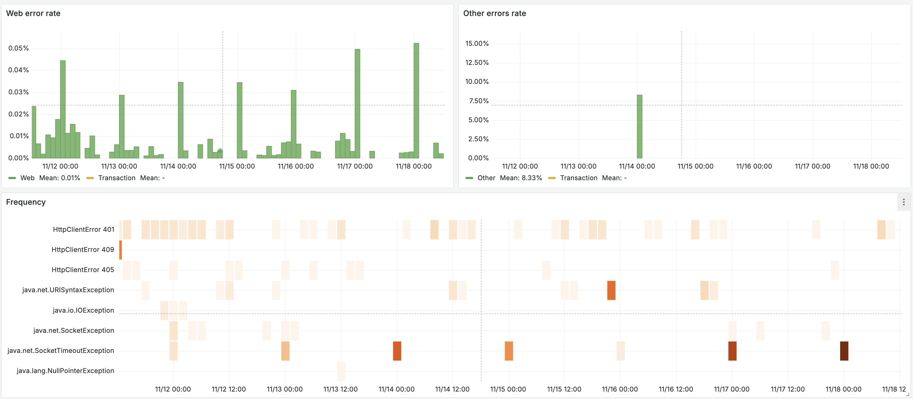

# Введение

Данный дашборд отображает ошибки приложения в удобной графической форме. На нем представлены графики частоты и хитмапа ошибок.
Частота ошибок разбита по двум типам транзакций: web и other.
Хитмап ошибок позволяет отследить частоту возникновения ошибок по их типам.

Страница отдельной ошибки содержит полный путь ошибки, сообщение в исключении, стектрейс и атрибуты агента.
