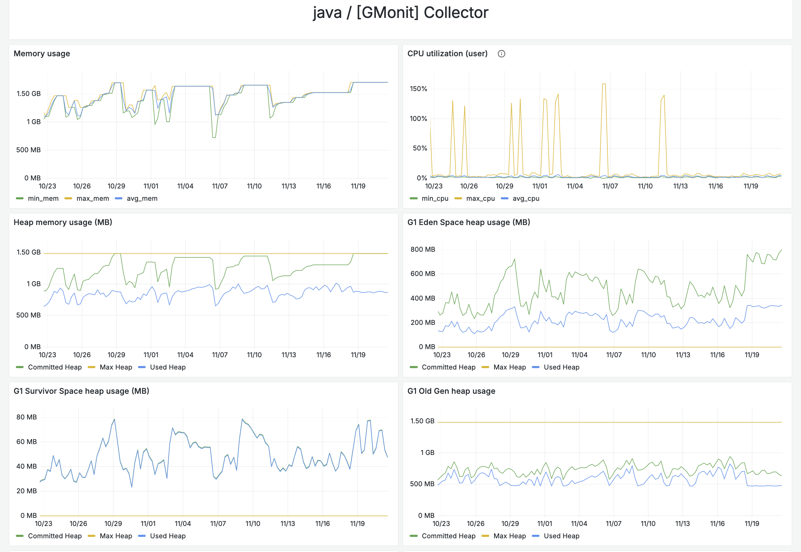
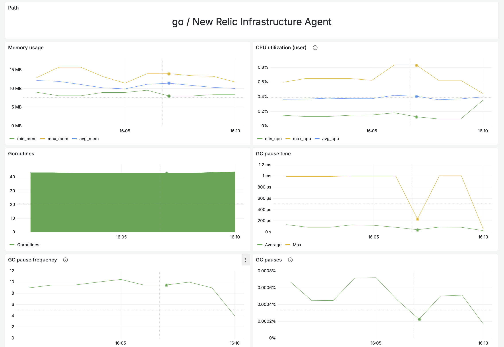

# Метрики платформы

В зависимости от платформы APM приложения, агенты могут собирать дополнительную телеметрию:
- Использование областей памяти
- Использование процессора
- Работа garbage collector
- Количество занятых тредов
- Информация о кешировании

## Примеры
### Метрики GMonit Collector (java)

### Метрики NR Infrastructure Agent (go)

