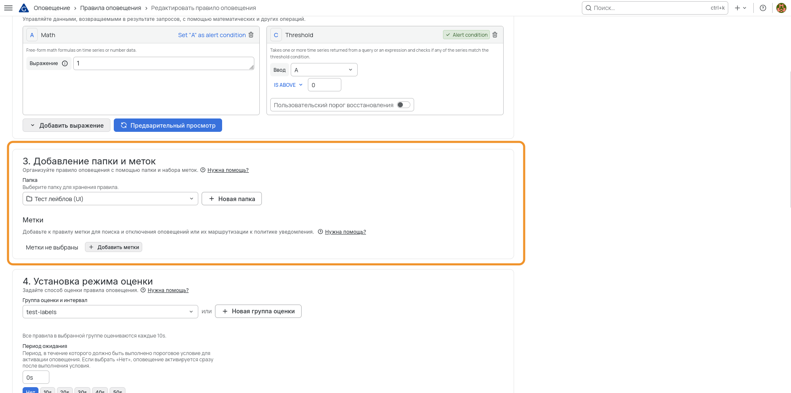
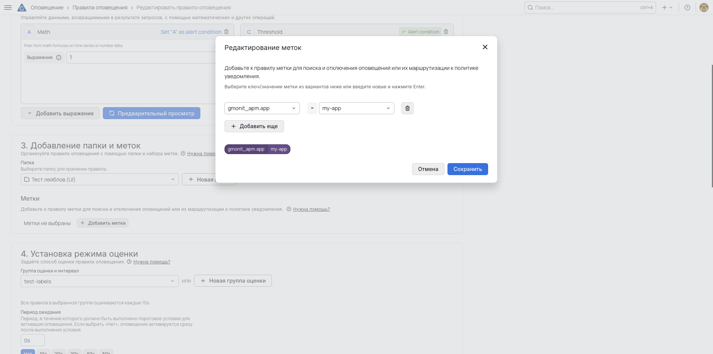

# Заполнение таблицы активных оповещений

На общем дашборде GMONIT сработавшие оповещения показываются в таблице активных оповещений. Часть столбцов таблицы — **Критичность**, **Сущность**, **Метрика** — заполняется не из самого оповещения, а из его **лейблов**.

Правила коробочного пакета проставляют эти лейблы автоматически, поэтому их строки в таблице заполнены. У **собственных (пользовательских) правил Grafana** таких лейблов нет, поэтому соответствующие столбцы у них остаются пустыми. Чтобы столбцы заполнились, проставьте лейблы на правиле вручную.

## Какие столбцы из каких лейблов берутся

| Столбец | Лейбл | Значение |
|---|---|---|
| **Критичность** | `gmonit_raci.severity` | `P1`, `P2` или `P3` |
| **Сущность** | один из лейблов сущности (см. ниже) | имя объекта оповещения |
| **Метрика** | `gmonit_alert_metric` | идентификатор метрики |

Остальные столбцы — **Длительность**, **Оповещение**, **Статус** — вычисляются автоматически и лейблов не требуют.

### Критичность

В лейбле `gmonit_raci.severity` указывается код `P1`, `P2` или `P3`. В таблице он показывается не как есть, а преобразуется в человекочитаемое название:

| Значение лейбла | Отображается в таблице |
|---|---|
| `P1` | Критический |
| `P2` | Предупреждение |
| `P3` | Информация |

Без этого лейбла ячейка пустая, а строка теряет приоритет при сортировке — таблица сортируется по критичности.

### Сущность

Значение берётся из **первого непустого** лейбла в списке (по типу мониторинга). Достаточно проставить один — тот, что соответствует объекту оповещения.

| Тип мониторинга | Лейбл | Значение |
|---|---|---|
| APM | `gmonit_apm.app` | имя приложения |
| Браузерный | `gmonit_browser.browser_app` | имя браузерного приложения |
| Инфраструктура (хост) | `gmonit_infra.host` | имя хоста |
| Инфраструктура (контейнер) | `gmonit_infra.container` | имя контейнера |
| База данных | `gmonit_db.entity_key` | ключ сущности БД |

### Метрика

Лейбл `gmonit_alert_metric` задаёт значение столбца **Метрика**.

## Прочие лейблы

Любые другие лейблы правила (кроме лейблов сущности и служебных) в отдельные столбцы не выводятся, но попадают в колонку **Детали** списком «лейбл → значение».

## Как проставить лейблы

Проставить лейблы можно двумя способами. Первый проще и подходит, когда правило следит за одной сущностью. Второй нужен, когда одно правило покрывает множество сущностей сразу.

### Способ 1. Статические лейблы на правиле

Лейблы задаются прямо в редакторе правила оповещения при его создании или изменении. Такие лейблы одинаковы для всех инстансов правила, поэтому способ подходит для правила, следящего за одной сущностью.

1. В боковом меню откройте **Оповещение** → **Правила оповещения** и создайте новое правило либо откройте существующее на редактирование.
2. Заполните имя, запрос и условие срабатывания.
3. В секции **3. Добавление папки и меток**, в блоке **Метки**, нажмите **Добавить метки**.



4. В окне **Редактирование меток** задайте ключ и значение (выберите из вариантов или введите новые и нажмите Enter). Ключ указывается как есть (например `gmonit_apm.app`), значение — из таблиц выше. Кнопкой **Добавить ещё** добавьте остальные лейблы.
5. Нажмите **Сохранить** в окне, затем сохраните само правило.



Минимальный набор, чтобы заполнить все три столбца:

```
gmonit_raci.severity = P2
gmonit_apm.app       = my-service
gmonit_alert_metric  = my_metric
```

### Способ 2. Лейблы из SQL (мультифасетные оповещения)

Оповещения Grafana многомерны: запрос правила возвращает таблицу, и **каждая строка результата становится отдельным инстансом оповещения**. Нечисловые столбцы строки превращаются в **лейблы** этого инстанса — имя лейбла равно имени столбца, значение берётся из ячейки. Числовые столбцы (значение метрики, порог) лейблами не становятся.

Это позволяет одним правилом покрыть множество сущностей: запрос выбирает, например, все приложения, а Grafana раскладывает результат на инстансы с уникальным набором лейблов. Лейблы берутся из результата, поэтому проставлять их вручную в секции **Labels** не нужно — их формирует сам SQL.

Как именно запрос формирует столбцы — не важно. **Важно только, чтобы имя столбца совпадало с ключом лейбла** из таблиц выше (`gmonit_apm.app`, `gmonit_alert_metric`, `gmonit_raci.severity` и т.д.) — тогда столбец корректно разложится в нужную колонку таблицы. Способ получения значения любой: константа-алиас или выражение.

Лейблы задаются прямыми алиасами столбцов. Ключ, содержащий точку (`gmonit_apm.app`, `gmonit_raci.severity`), заключается в двойные кавычки — иначе ClickHouse воспримет его как обращение к вложенному полю.

```sql
select *
from (
  with
    $__timeInterval($__fromTime) as from_time,
    $__timeInterval($__toTime)   as to_time
  select
    $__timeInterval(point)      as time,
    MetricApdex(name = 'Apdex') as value,                 -- числовой столбец для порога
    app_name                    as "gmonit_apm.app",      -- столбец Сущность
    'APM apps apdex'            as gmonit_alert_metric,   -- столбец Метрика, произвольное обозначение метрики
    'P2'                        as "gmonit_raci.severity" -- столбец Критичность
  from nr_metric_data_by_name_by_minute_v2
  where point >= from_time
    and point <= to_time
    and account_id = {{ACCOUNT_ID}}
    and AppMetric(name = 'Apdex')
  group by all
  order by "gmonit_apm.app"
         , time with fill
                     from from_time
                     to to_time
                     step $__interval_s
)
order by time
```

Здесь одно правило раскладывается на инстансы по приложениям (`app_name`), а профиль важности задан константой `'P2'` — одинаковый для всех.
