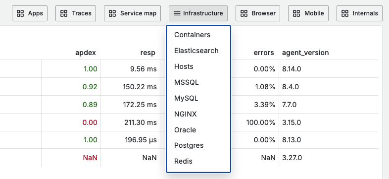
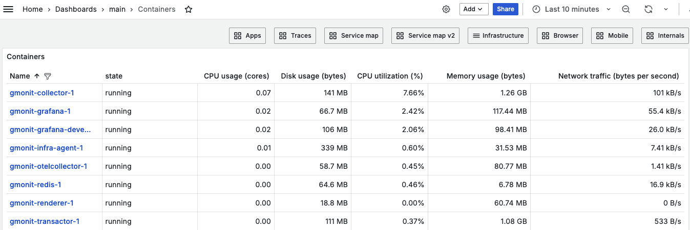
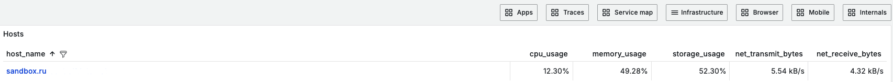
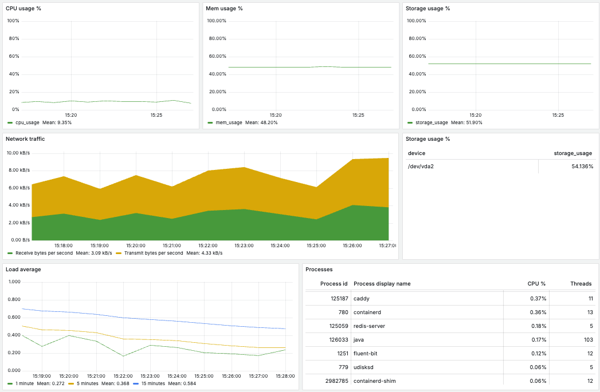

# Мониторинг хоста и Docker-контейнеров

Для перехода к дашбордам инфраструктурного мониторинга используем выпадающий список Infrastructure (в правом верхнем углу).

На дашбордe **Containers** по каждому контейнеру можно посмотреть показатели использования ядер процессора (CPU usage Cores), загрузку процессора (CPU usage), использование памяти (Mem usage) и хранилища (Storage usage), количество перезапусков контейнера и статистику по сетевому трафику (Network traffic).

Дашборд **Hosts** содержит сводные графики здоровья хоста: CPU usage, Mem usage, Storage usage, Network traffic. Load average - средние значения загрузки системы за определённый период времени (1, 5, 15 мин) и процессы запущенные в системе - Processes.

