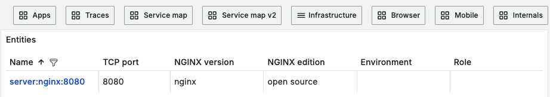

## Мониторинг NGINX

При переходе через меню мониторинга мы попадаем на дашборд с веб-серверами, на которые установлен агент. 

Графики выводят следующие количественные метрики по запросам и соединениям:
**Requests per minute** - показывает количество HTTP-запросов, обработанных сервером за минуту. 

**Active Connections** - число текущих активных соединений с веб-сервером. Дает представление о текущей нагрузке на сервер.

**Connections Accepted per minute** - количество соединений, которые были приняты сервером за минуту.

**Connections Dropped per minute** - количество соединений, которые были отклонены или сброшены сервером за минуту.

**Connections Reading** - количество соединений, в которых Nginx читает данные, полученные от клиентов. Рост этой метрики может сигнализировать о высоких объемах входящего трафика, что может повлиять на скорость обработки.

**Connections Waiting** - количество соединений, находящихся в состоянии ожидания (idle), когда все данные были прочитаны, но новые данные пока не поступили. Высокое значение может указывать на задержки и проблемы с соединениями.

**Connections Writing**  - количество соединений, в которых Nginx отправляет данные клиентам. Это показывает активность ответа сервера на запросы пользователей. 
