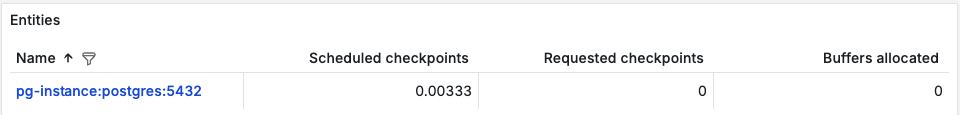
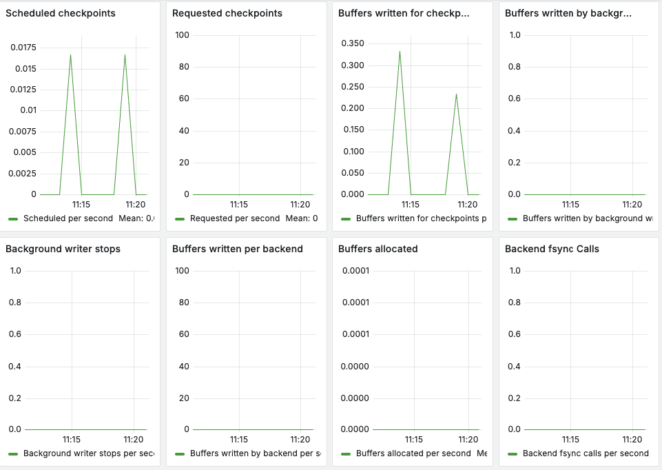

# Мониторинг PostgreSQL

Ключевые метрики производительности:

**Checkpoint write time** ms/sec - это время в миллисекундах, которое требуется для записи контрольной точки. Контрольная точка - это процесс, который PostgreSQL использует для сохранения состояния базы данных на диск. Долгое время записи может указывать на проблемы с производительностью диска или большую нагрузку на запись данных. В идеале, время должно быть минимальным, чтобы избежать блокировок и задержек.

**Checkpoint sync time** - это время, затраченное на выполнение операции синхронизации при создании контрольной точки. Операция синхронизации гарантирует, что все изменения, сделанные в памяти, будут записаны на диск. Высокое значение может указывать на проблемы с дисковой подсистемой или медленные операции ввода-вывода. Долгое время синхронизации может привести к задержкам в обслуживании запросов.

**Index sizes** - это размеры индексов на ваших таблицах в базе данных PostgreSQL. Индексы используются для ускорения поиска данных в таблицах. Крупные индексы могут замедлять вставку, обновление и удаление данных. Растущие индексы также могут указывать на фрагментацию данных, что снижает производительность запросов.

**Buffer allocated per second** - это количество буферов, выделяемых в секунду. Буферы используются для временного хранения данных перед их записью на диск или отображением на экране. Высокие значения могут указывать на активную работу с буферами, что требует мониторинга нагрузки на память.

**Backend FSync calls per second** - это количество вызовов FSync для бэкендов в секунду. Операция FSync гарантирует, что все изменения, сделанные в памяти, будут записаны на диск. Высокое количество вызовов может указывать на большую нагрузку на дисковую систему или частые записи данных на диск.

**Buffers written per backend** - это количество буферов, записываемых каждым бэкендом. Бэкенды - это процессы, которые обрабатывают запросы к базе данных. Высокое количество записанных буферов может сигнализировать о высоком уровне изменений в базе данных.

**Table raws inserted per second** - это количество строк, вставленных в таблицу в секунду. Высокая скорость вставки данных указывает на активную запись в базу данных. Если скорость вставки падает, это может сигнализировать о проблемах с производительностью или блокировках.

**Table sizes in bytes** - это размеры таблиц в байтах. Растущие размеры таблиц могут привести к ухудшению производительности запросов.

**Table bloat size and percent bloat** - это размер и процент раздувания таблицы. Раздувание таблицы происходит, когда в ней хранится больше данных, чем необходимо для ее эффективной работы. Большой процент «раздувания» таблицы может привести к замедлению запросов и увеличению расхода дискового пространства.

**Database connections count** - это количество активных соединений к базе данных. Может указывать на высокую нагрузку на сервер, что требует настройки пула подключений и контроля за ресурсами.

**Buffer hits per second** - это количество попаданий в буфер в секунду. Попадание в буфер означает, что данные уже были загружены в память и не требуют повторной загрузки.

**Deadlocks per second** - это количество взаимных блокировок в секунду. Взаимоблокировка происходит, когда два или более процессов пытаются получить доступ к одному и тому же ресурсу одновременно. Наличие взаимных блокировок указывает на проблемы с конкурентным доступом к данным. Множество блокировок может вызвать простои и задержки в выполнении запросов.
