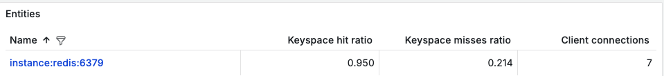
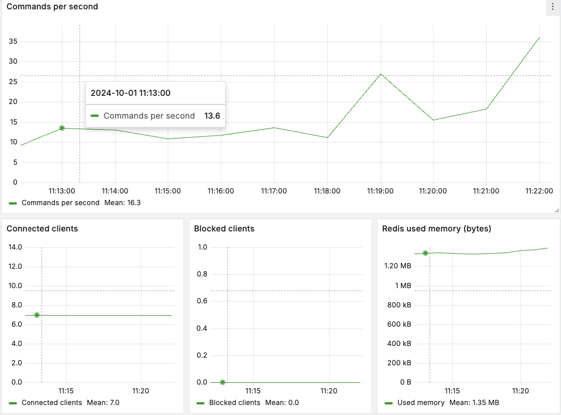

# Мониторинг Redis

Собирает следующие метрики, которые помогают лучше понимать текущее состояние инстансов Redis и своевременно реагировать на потенциальные проблемы с производительностью или ресурсами:

**Commands per second** - количество команд, обработанных в секунду. Высокое значение указывает на интенсивную активность, в то время как резкое падение может свидетельствовать о проблемах с задержкой или блокировками.

**Connected clients** - количество клиентов, которые в данный момент подключены к серверу Redis. Каждый клиент представляет собой активное подключение к базе данных. Высокое число подключений может указывать на пиковую нагрузку, что требует управления ресурсами. Наблюдение за количеством подключенных клиентов помогает предсказать возможные проблемы с масштабируемостью.

**Blocked clients** - количество клиентов, которые заблокированы в ожидании завершения длинных операций, таких как команды BLPOP или BRPOP, блокирующие операции с очередями. Большое количество заблокированных клиентов может означать проблемы с производительностью, так как операции, на которые они ожидают, могут быть медленными или заблокированными.

**Redis used memory** (bytes) - память используемая Redis. Метрика включает в себя память, занятую всеми данными, кэшем, и дополнительной информацией для управления объектами. Исчерпывание памяти может привести к сбросу ключей или сбоям.

**Changes since last save** - количество изменений данных (записей) с момента последнего сохранения на диск. Если количество изменений с последнего сохранения велико, то в случае сбоя данные могут быть потеряны. Своевременное сохранение данных на диск критически важно для минимизации потерь.

**Keyspace hit ratio** - Это отношение количества успешных запросов к ключам к общему количеству запросов. Рассчитывается как: (keyspace_hits / (keyspace_hits + keyspace_misses)). Высокое значение этой метрики говорит о том, что большинство запросов находят нужные данные в кэше, что повышает производительность системы. Низкое значение указывает на то, что сервер часто не находит запрашиваемые ключи.

**Evicted keys per second** - показатель количества ключей, которые Redis удалил из памяти из-за нехватки ресурсов (когда достигнут лимит по памяти). Эти ключи вытесняются согласно выбранной политике управления памятью. Если ключи часто вытесняются, это может указывать на проблемы с памятью или на необходимость увеличения объема памяти.

**Network I/O per second** (bytes) - метрика показывает количество данных, отправляемых и получаемых через сеть каждую секунду. Она отражает объем трафика между сервером Redis и его клиентами. Высокое сетевое потребление может повлиять на общую производительность.

