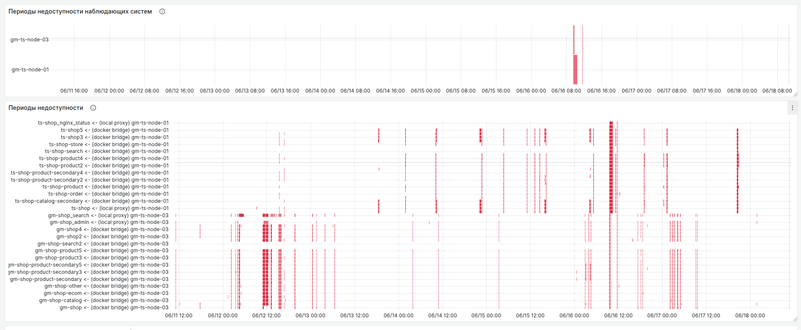
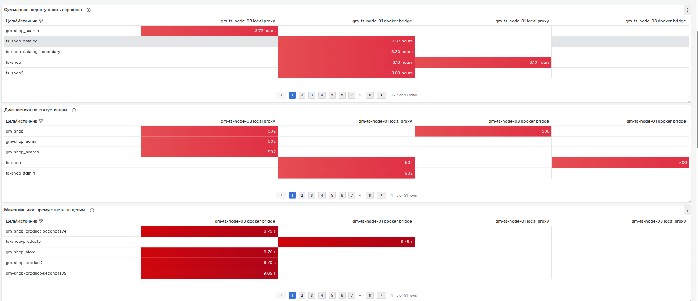
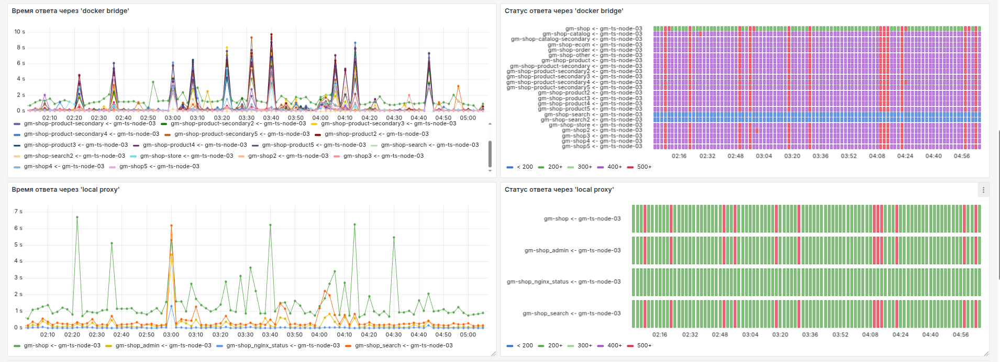

## Доступность веб-сервисов

Дашборд мониторинга веб-систем предназначен для проверки доступности и производительности веб-ресурсов через различные сетевые маршруты. Решение использует NRI агенты в качестве наблюдающих систем, которые могут находиться в разных сетевых контурах и наблюдать за множеством конечных точек.

Мониторинг осуществляется с помощью интеграции nri-flex, которая выполняет запросы через curl с заданным таймаутом и собирает метрики HTTP-кодов ответа и времени выполнения запроса

Дашборд предоставляет следующие функции мониторинга:

- Регулярный контроль доступности веб-эндпоинтов через различные сетевые маршруты
- Замер времени отклика проверяемых систем
- Анализ HTTP-статусов ответов для диагностики проблем
- Настройка интервала проверки

## Иллюстрация работы

Дашборд позволяет проводить фильтрацию по:
- Наблюдающим системам
- Сетевому пути
- Целевым системам
- Порогу простоя
  
### Мониторинг доступности систем

 
Этот раздел дашборда визуализирует данные о периодах недоступности наблюдающих и целевых систем. 
Вертикальные красные линии указывают на моменты, когда одновременно были недоступны целые кластеры систем. Горизонтальные линии отражают продолжительность периодов недоступности, помогая оценить длительность и масштаб проблем.

### Аналитика производительности и доступности

Этот раздел дашборда отображает ключевые метрики доступности сервисов:

- Общее время недоступности – суммарная длительность периодов, когда сервис не отвечал.
- Наихудший статус-код – самый критический HTTP-код ошибки, зафиксированный за выбранный период.
- Максимальное время ответа – наибольшая задержка отклика целевых систем.

Данные представлены в разрезе мониторинговых систем, что позволяет оперативно выявлять проблемные узлы.

Панели с динамикой времени ответа систем и изменений HTTP-статусов в разрезе сетевого пути.
Графики позволяют сравнивать производительность и доступность систем через различные сетевые пути, выявлять аномалии и коррелировать проблемы с конкретными маршрутами.

## [Настройка и запуск мониторинга доступности веб-систем](/modules/infra/urlcheck/setup.md)
