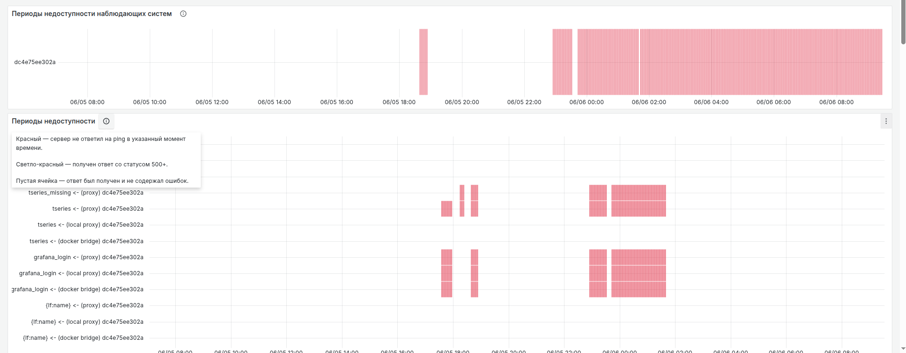
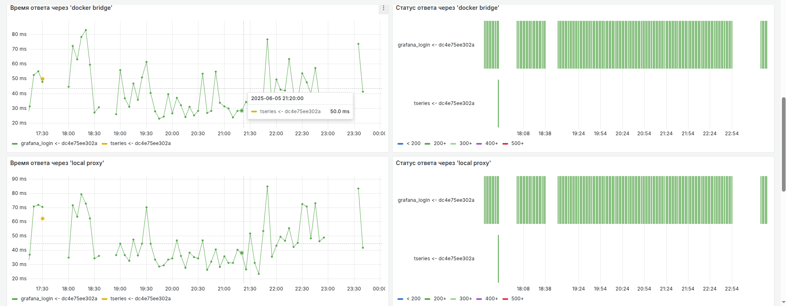

## Доступность веб-сервисов

Дашборд мониторинга веб-систем предназначен для проверки доступности и производительности веб-ресурсов через различные сетевые маршруты. Решение использует инфраструктурные сущности (хосты, Docker-контейнеры) в качестве наблюдающих систем.

Мониторинг осуществляется с помощью интеграции nri-flex, которая выполняет запросы через curl с заданным таймаутом и собирает метрики HTTP-кодов ответа и времени выполнения запроса

Дашборд предоставляет следующие функции мониторинга:

- Регулярный контроль доступности веб-эндпоинтов
- Замер времени отклика проверяемых систем
- Анализ HTTP-статусов ответов для диагностики проблем
- Управление конфигурацией проверяемых ресурсов
- Наблюдение за различными сетевыми маршрутами доступа к системам
- Настройка интервала проверки

## Иллюстрация работы

фильтры по:

- Наблюдающим системам
- Сетевому пути
- Целевым системам
- Порогу простоя
  
мониторинг доступности систем
 
Верхняя секция отображает:

Хронологию периодов недоступности с цветовой индикацией, таблица недоступности всех отслеживаемых систем

аналитика производительности

Секция статус-кодов:

Динамика изменения кодов состояния

Секция времени ответа:

Сравнительные графики времени ответа по разным сетевым маршрутам

## [Настройка и запуск мониторинга доступности веб-систем](urlcheck/setup.md)
