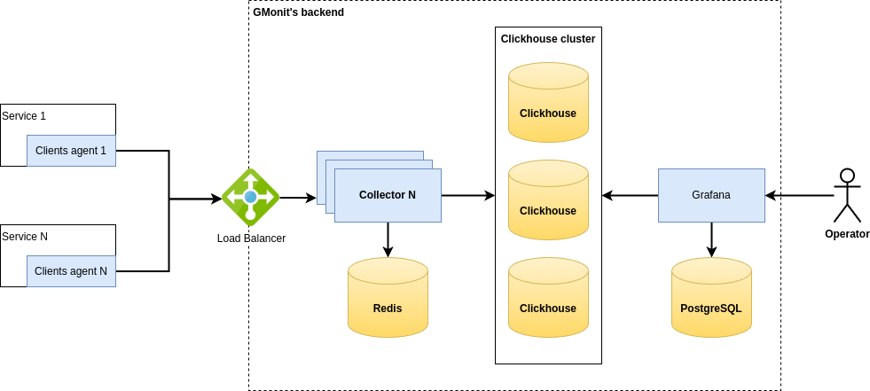

# Схема масштабирования GMonit
Продукт [**GMonit**](https://gmonit.ru) поддерживает механизмы обеспечения отказоустойчивости и горизонтального масштабирования.

Есть *3 потенциальные точки для масштабирования* системы:
1. **Collector**. Для обеспечения высокой пропускной способности системы и ее отказоустойчивости, предусмотрена возможность запуска нескольких экземпляров сервиса. Сам collector спроектирован с учетом задач горизонтального масштабирования и является полностью stateless. Для распределения HTTP запросов между экземплярами сервиса необходимо настроить балансировщик нагрузки.
2. [**Clickhouse**](https://clickhouse.com/). Настройка кластера Clickhouse выполняется в соответствии с  [официальной документацией](https://clickhouse.com/docs/ru/getting-started/tutorial/#cluster-deployment) к этому продукту. Такая конфигурация может решать одновременно и задачи масштабирования и задачи обеспечения отказоустойчивости основного хранилища данных. В collector’е не предусмотрена клиентская балансировка запросов к БД, поэтому ее нужно реализовывать внешними балансировщиками. 
3. [**Grafana**](https://grafana.com/). Бэкенд Grafana может быть запущен в нескольких экземплярах как для обеспечения масштабирования, так и в целях обеспечения отказоустойчивости решения. При этом, так же необходимо предусмотреть балансировку нагрузки между запущенными экземплярами. 

> Организовывать масштабирование системы можно как по каждому из перечисленных пунктов в отдельности, так по любой их комбинации в зависимости от потребностей конкретного развертывания. 