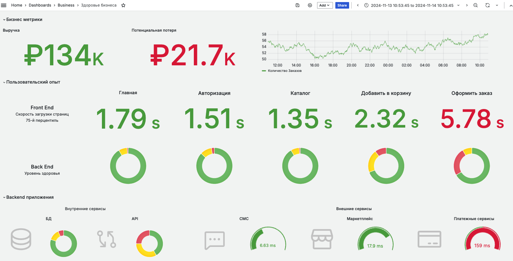

# Дашборд здоровья бизнеса

Наш продукт может помочь отразить верхнеуровневую картину бизнеса в разрезе IT-систем при помощи **Дашборда здоровья бизнеса**.

## 1. Уровень бизнеса в разрезе IT-метрик

**Дашборд здоровья бизнеса** отражает верхнеуровневую картину состояния IT-системы.

Основные компоненты дашборда:

- **Бизнесовые метрики**: например, денежные показатели.
- **Бизнес-процессы**: на примере пяти основных шагов оформления заказа.
- **Связка с фронтендом и бэкендом**: отображается связь бизнес-процесса с техническими компонентами.
- **Инфраструктурные сервисы**: здоровье баз данных, внешних сервисов и прочее.
- **Показатели здоровья**: подсветка ключевых факторов в режиме реального времени по светофору (зелёный, жёлтый, красный).

Этот дашборд полезен для руководителей направлений, технических директоров, а также для инженеров эксплуатации, разработчиков и поддержки. Мы рекомендуем размещать его на видном месте в офисе для оперативного мониторинга.

Например, мы видим, что на этапе **«оформления заказа»** у нас происходит деградация:

- **Скорость загрузки на фронте** подсвечивается красным. Это может быть связано с превышением допустимого времени загрузки, например, больше двух секунд.
- **Уровень здоровья на бэкенде** также понизился. Это означает, что увеличилось количество операций, выполняемых долго или с ошибками.

## 2. Переходим к деталям

Мы можем провалиться по клику на проблемный сегмент (на красный сегмент «бублика» оформления заказа, см. скрин) и перейти на страницу соответствующего бэкенд-сервиса.

На этой странице мы видим:

- **Статистику**: время ответа, количество ошибок, статус-коды.
- **Топ медленных запросов к базе данных**.
- **Уровень здоровья транзакций**: детализация по конкретным операциям.

## 3. Переходим к конкретной транзакции

Далее, мы переходим к самой транзакции (нажать на бублик уровня бэкенда, см. скрин), которая отвечает за оформление заказа.

На уровне транзакций мы можем:

- **Разбить время ответа**: понять, из чего складывается общее время выполнения транзакции (вызовы внешних сервисов, запросы к базе данных и т.д.).
- **Посмотреть пропускную способность**: сколько запросов в секунду обрабатывается.
- **Проанализировать ошибки**: количество, типы, статус-коды.
- **Использовать метрику Apdex**: интегральный показатель здоровья транзакции.

## 4. Переходим к медленным транзакциям, видим деградацию со стороны внешних запросов

У нас есть возможность посмотреть самые медленные трассировки транзакций.

Шаги:

1. **Выбираем самую длинную транзакцию**, которая выполнялась, например, 7 секунд.
2. В разделе **Summary** видим, что значительную часть времени заняли вызовы внешних сервисов и запросы к базе данных.
3. Обнаруживаем, что происходит множество одинаковых последовательных вызовов в базу данных (ошибка типа **N+1**).
4. **Проваливаемся до конкретных запросов и их параметров** для детального анализа.

