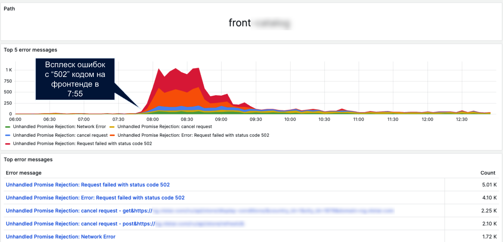
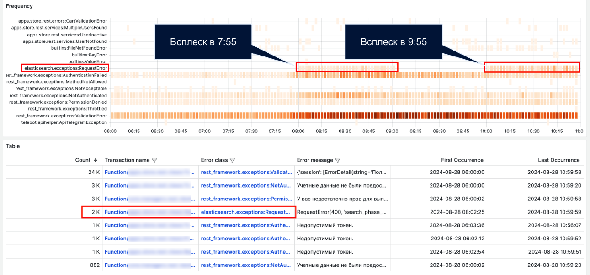
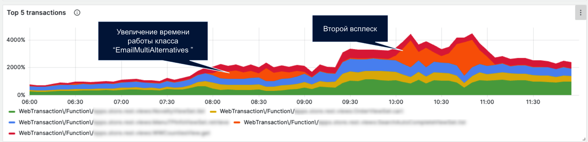
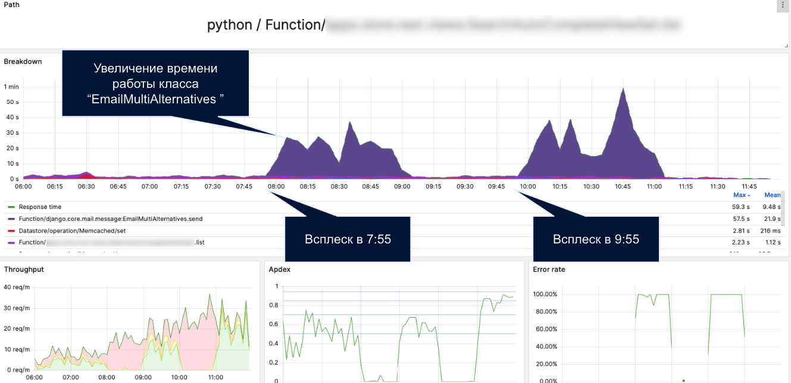

# Анализ ошибок 502 на фронтенде и проблем с Elasticsearch на бэкенде

## Описание проблемы

В **7:55 по МСК** на фронтенде начали появляться ошибки со статусом **502**. Это может свидетельствовать о проблемах с Nginx, который не смог установить соединение с бэкендом и получить от него ответ.

На бэкенде эти ошибки могут быть связаны с взаимодействием с **Elasticsearch**, что подтверждает класс ошибки **`elasticsearch.exceptions.RequestError`** и время возникновения.

Ошибки взаимодействия с Elasticsearch возникали при работе транзакции **`Function/apps.store.rest.views:SearchAutoCompleteViewSet.list`**.

В результате наблюдалось увеличение работы класса **`EmailMultiAlternatives`** внутри модуля **`django.core.mail.message`**.

## Гипотеза

В **7:55** возникли ошибки на фронтенде со статусом **502**.

**Гипотеза**: проблема с Nginx, который не смог установить соединение с бэкендом и получить от него ответ.

На бэкенде эти ошибки могут быть связаны с взаимодействием с Elasticsearch, класс ошибки **`elasticsearch.exceptions.RequestError`**. По времени они совпадают с двумя очагами транзакции **`Function/apps.store.rest.views:SearchAutoCompleteViewSet.list`**.
