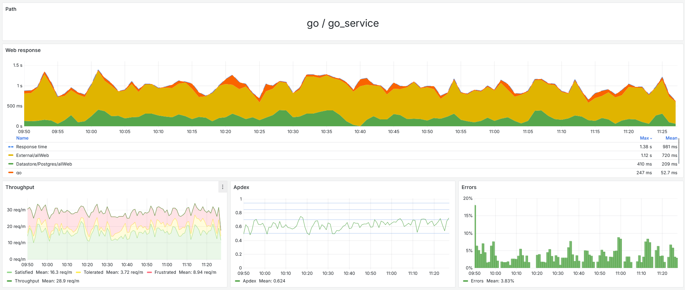

# Документация по решению проблемы производительности приложения с помощью GMonit

## 1. Выявление проблемы

При возникновении проблем с производительностью приложения важно оперативно их выявить. С помощью GMonit можно:

- **Отслеживать ключевые метрики**: нагрузка на сервисы, время отклика, потребление ресурсов.
- **Обнаруживать аномалии**: сравнивать текущие показатели с историческими данными.
- **Получать оповещения**: настраивать уведомления при превышении пороговых значений.

## 2. Шаги для анализа

### Шаг 1: Сбор и анализ метрик

- **Соберите данные** о нагрузке на сервисы, количестве запросов, времени обработки.

- - На представленном изображении видно, что наибольшую долю времени сервис выполняет запросы во внешние системы
- **Идентифицируйте проблемные транзакции**, обратив внимание на те, у которых увеличилось время выполнения или потребление ресурсов.

### Шаг 2: Трассировка транзакций

- **Используйте инструменты трассировки** GMonit для детального анализа выполнения запросов.
- **Выявите внешние вызовы**: определите, к каким внешним сервисам обращается приложение и с какой частотой.

### Шаг 3: Поиск паттернов N+1

- **Проанализируйте количество запросов** к внешним сервисам в рамках одной транзакции.
- **Определите избыточные запросы**: если один и тот же сервис вызывается многократно, рассмотрите возможность оптимизации.

### Шаг 4: Оптимизация асинхронных операций

- **Оцените эффективность асинхронных вызовов**: убедитесь, что накладные расходы не превышают выгоды.
- **Сократите количество асинхронных запросов**, объединив их в пакетные операции при необходимости.

### Шаг 5: Корректировка конфигурации

- **Настройте параметры** тайм-аутов, количества реплик сервисов и других конфигурационных настроек.
- **Добавьте ресурсы**: при необходимости увеличьте вычислительные мощности для обработки нагрузки.

## 3. Резюме

Для эффективного решения проблем производительности с помощью GMonit следует:

- **Быстро выявлять проблемы** путем мониторинга метрик и оповещений.
- **Пошагово анализировать** проблемные области, используя инструменты трассировки и анализа.
- **Оптимизировать код и конфигурацию**, устраняя узкие места и повышая эффективность приложения.

Регулярное использование GMonit и следование данным шагам поможет поддерживать высокую производительность и стабильность вашего приложения.
