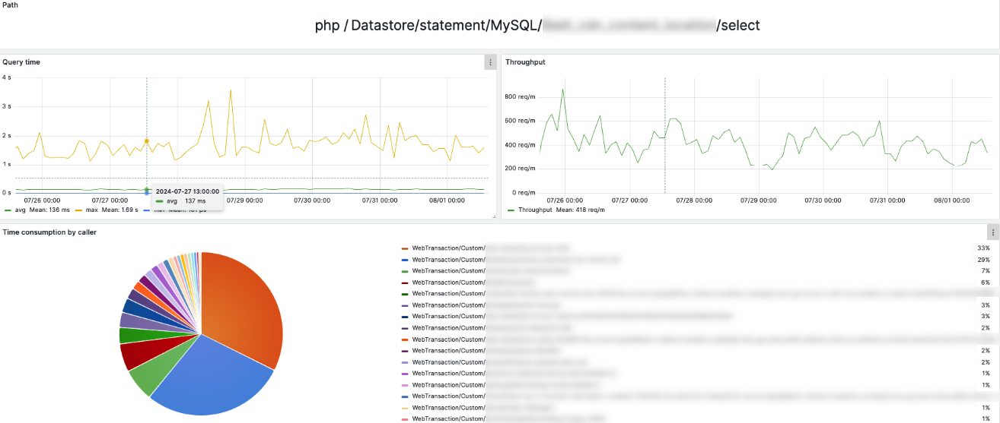
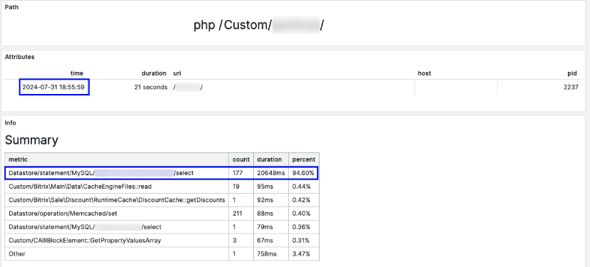

# Анализ высокой нагрузки на сервис

## Описание проблемы

- **Данные за последние 7 дней** были отобраны для анализа.

- В разделе **Datastore** обнаружено, что запрос к таблице `likeit_cdn_content_location/select` используется в большом количестве различных транзакций.

- Произведён отбор верхнеуровневых транзакций, которые стали доступны после доразметки транзакции `Uri/bitrix/urlrewrite.php`.

- **Длительное время выполнения** запроса `Datastore/statement/MySQL/likeit_cdn_content_location/select` заметно влияет на производительность.

- При анализе медленных транзакций

подтверждено, что основной проблемой является именно этот запрос.

- Проблема наблюдается также при других запросах.

## Потенциальная проблема

В ходе анализа данных за период с **22 по 29 июля** выявлена серьёзная проблема, потенциально влияющая на производительность системы.

- Основная сложность заключается в длительном времени выполнения запроса к таблице `likeit_cdn_content_location`.
- Это может быть связано с проблемой **N+1**, при которой для каждого основного запроса выполняется дополнительный запрос, значительно увеличивая общее время выполнения.

### Проблема N+1

- **Проблема N+1** означает, что для каждого элемента основного набора данных выполняется отдельный дополнительный запрос.
- Это приводит к **экспоненциальному росту** числа запросов и времени их выполнения.
- В результате система испытывает повышенную нагрузку, что негативно сказывается на её производительности и отклике для пользователей.

## Гипотеза и рекомендации

**Гипотеза**: Оптимизация запросов путём использования соединений (`JOIN`) или подзапросов вместо множественных одиночных запросов может существенно снизить нагрузку и время выполнения.

**Рекомендуемые действия:**

1. **Анализировать текущие запросы** к таблице `likeit_cdn_content_location` на предмет избыточности и повторений.
2. **Оптимизировать SQL-запросы**, объединяя множественные одиночные запросы в более эффективные с использованием `JOIN` или подзапросов.
3. **Проверить индексы** на таблицах, участвующих в запросах, и при необходимости добавить недостающие индексы для ускорения выборки данных.
4. **Провести нагрузочное тестирование** после внесения изменений, чтобы убедиться в улучшении производительности и отсутствии побочных эффектов.
5. **Мониторить систему** в режиме реального времени для своевременного обнаружения и устранения подобных проблем в будущем.

## Заключение

Оптимизация запросов и устранение проблемы N+1 могут значительно улучшить производительность системы, снизить нагрузку на базу данных и обеспечить более быстрый отклик для пользователей. Рекомендуется провести детальный анализ и внедрить необходимые изменения в ближайшее время.
